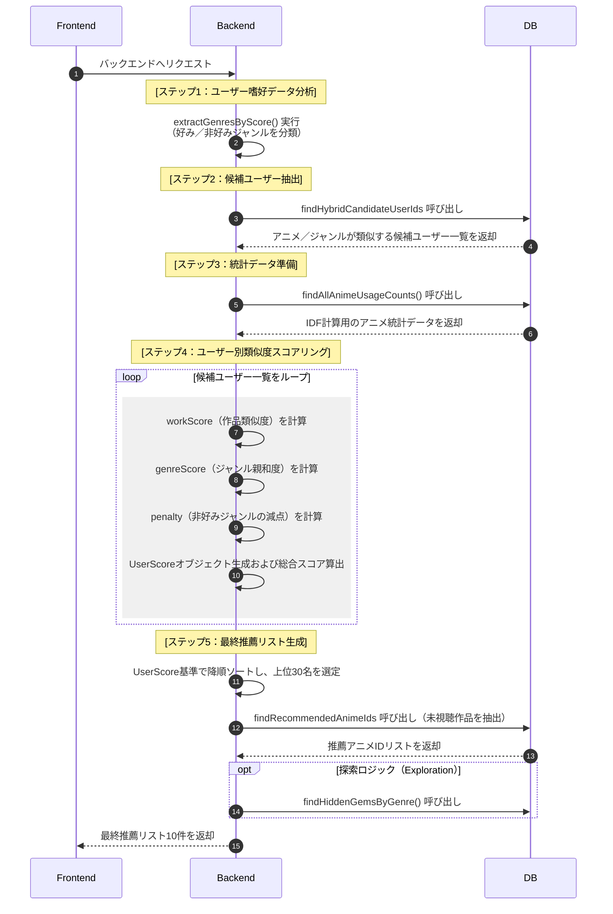

# AniReco

- 目的：アニメ情報の提供および推薦コミュニティ
- 開発期間：2026.03.12 ～ 2026.04.30
- [デプロイリンク](https://ani-frontend-ek9a.onrender.com/)
- [バックエンド GitHub リンク](https://github.com/rlarbtns5898-design/ani)

## 目次

- [チーム構成および担当業務](#チーム構成および担当業務)
- [DBモデリング](#DBモデリング)
- [シーケンスダイアグラム](#シーケンスダイアグラム)
- [トラブルシューティングおよび解決](#トラブルシューティングおよび解決)
- [主要機能](#主要機能)

## チーム構成および担当業務

#### キム・ギュスン

#### ユ・ヒョンホ

## DBモデリング

-

## シーケンスダイアグラム

-[sequence](./README_img/SEQUENCE.md)

## トラブルシューティングおよび解決

## 主要機能

