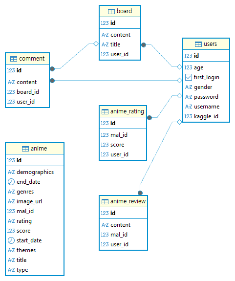

# AniReco

- 目的：アニメ情報の提供および推薦コミュニティ
- 開発期間：2026.03.12 ～ 2026.04.30
- [デプロイリンク](https://ani-frontend-ek9a.onrender.com/)
- [バックエンド GitHub リンク](https://github.com/rlarbtns5898-design/ani)

## 目次

- [技術スタック](#技術スタック)
- [チーム構成および担当業務](#チーム構成および担当業務)
- [DBモデリング](#DBモデリング)
- [シーケンスダイアグラム](#シーケンスダイアグラム)
- [主要機能](#主要機能)
- [トラブルシューティングおよび解決](#トラブルシューティングおよび解決)

## 技術スタック

### Frontend
- React 19.2.4
- JavaScript 
- CSS3

### Backend
- Spring Boot 3.2.5
- Java 17

### Database
- RenderDB

### API
- Jikan API

### Tools
- Render
- Git / GitHub

## チーム構成および担当業務

#### キム・ギュスン

#### ユ・ヒョンホ

## DBモデリング

-

## シーケンスダイアグラム

-[sequence](./README_img/SEQUENCE.md)
## 主要機能

### 推薦アルゴリズムの詳細 (Recommendation Logic)

#### Step 1: ユーザー分析

ユーザーの過去の評価データを分析し、好みのジャンルと非選好ジャンルを自動的に分類します。
extractGenresByScore() を実行し、後続のスコアリング段階において加点および減点を適用するための基準を定義します。
本プロジェクトのコアとなるハイブリッド推薦システムは、以下の3つの主要スコアを合算して算出されます。

#### Step 2: 候補ユーザー群の抽出 

一次候補群
findHybridCandidateUserIds を用いて候補ユーザーを取得します。
自身と共通の作品を視聴しているユーザーを優先的に500人抽出します。

二次候補群
共通視聴ユーザーが十分に存在しない場合、ユーザーの好みのジャンルを視聴しているユーザーを追加で取得します。

#### Step 3: 統計データの準備 

findAllAnimeUsageCounts() を通じて各作品の出現頻度を把握し、それを基に IDF（逆文書頻度）重みを計算する準備を行います。

#### Step 4: ユーザー類似度スコアリング 

候補ユーザーごとに以下の3つの指標を組み合わせ、最終的な類似度スコアを算出します。

WorkScore（作品類似度）:
IDF重みを適用し、一般的に広く視聴されている人気作品よりも、比較的視聴者数の少ない作品を共有している場合に高いスコアを付与します。 

$$
計算: WorkScore = 10 \cdot \sum IDF(i)
$$

GenreScore（ジャンル親和度）:
ユーザーの好みのジャンルと候補ユーザーの視聴傾向との一致度を評価します。

$$
計算: GenreScore = 5 \cdot \text{avg}(\text{matchcount} \cdot 2.0)
$$

Penalty（非選好ジャンル減点）:
ユーザーが好まないジャンルを主に視聴しているユーザーに対して減点を行い、推薦精度を向上させます。

$$
計算: Penalty = \sum (\text{MatchCount} \cdot 1.5)
$$

$$
最終計算：　TotalScore(u) = WorkScore + GenreScore - Penalty
$$

#### Step 5: 最終推薦リストの生成 (Recommendation Generation)

総合スコア（TotalScore)が高い上位30名のユーザーを「近傍ユーザー」として選定します。

未視聴作品の抽出
findRecommendedAnimeIds を用いて、近傍ユーザーが高く評価している一方で、対象ユーザーが未視聴の作品を抽出します。

探索ロジック（Exploration）:
抽出された作品数が10件未満の場合、findHiddenGemsByGenre() を利用して、ユーザーの好みのジャンルに属する高評価かつ比較的認知度の低い作品（いわゆる隠れた名作）をランダムに追加し、推薦リストを補完します。
## トラブルシューティングおよび解決
### 1. 推薦リストの一般化（人気作への偏り）問題の解決
-【問題点】

初期の推薦ロジックでは、「ジャンル一致」と「共通視聴数」のみを基準としていたため、『ONE PIECE』や『進撃の巨人』のような圧倒的に視聴者数の多い人気作品が推薦の上位を占める問題が発生しました。
その結果、ユーザー固有の好みが十分に反映されず、パーソナライズ性の低い推薦となっていました。

-【原因分析】

初期には、推薦結果が人気作品に偏る原因がアルゴリズムの実装ミスにある可能性を疑い、スコア計算ロジック全体に対して詳細な検証を行いました。

具体的には、各ユーザー間の類似度計算過程において、

共通視聴作品数
ジャンル一致数
最終スコア（TotalScore）
候補群の作品履歴
などをログとして出力し、意図した通りに計算が行われているかを段階的に確認しました。

しかし、ログを確認した結果、スコア計算自体には明確な実装バグは見つかりませんでした。むしろ、人気作品（例：視聴者数が極端に多い作品）が含まれる場合、どのユーザー間でも共通要素として頻繁にカウントされており、その影響でスコアが一貫して高くなる傾向が確認されました。

この検証から、問題の本質はコードの不具合ではなく、「人気作品による偏り」にあると結論づけました。
すなわち、多くのユーザーが視聴して高く評価している作品は「偶然の一致」を生みやすく、それが類似度スコアを不自然に押し上げていたことが原因でした。

#### -【解決策1：IDF (逆文書頻度) の導入】

自然言語処理などで用いられるIDF(Inverse Document Frequency)の概念を推薦アルゴリズムに導入しました。

自然言語処理で用いられるIDF（Inverse Document Frequency）の概念を推薦アルゴリズムに導入しました。

ロジック
全ユーザーの視聴データを基に、視聴数が多い作品の重みを低減し、視聴数が少ない作品（ニッチ作品）が一致した場合に高いスコアを付与するように設計しました。

* **数式**:

$$ 
IDF(i) = \log \left( \frac{N + 1}{df(i) + 1} \right) + 1.0 
$$

#### -【解決策2：非選好ジャンルに基づくペナルティ（Penalty)の導入】

ユーザーが好まないジャンルを多く視聴している候補ユーザーに対して、スコア減点（Penalty）を導入しました。

ロジック
「一部だけ似ているユーザー」ではなく、“全体的な嗜好が近いユーザー”を優先的に選定するため非選好ジャンルの一致数に比例してスコアを減点しました

【結果】

人気作品への過度な偏りが緩和され、ユーザーの嗜好により近い作品が上位に表示されるようになりました。
その結果、推薦の多様性と精度（パーソナライズ性）の両方が向上しました。

### 2. Jikan API フィルター適用エラーの解決

-【問題点】

アニメ検索機能の実装時、ジャンル・テーマ・対象（デモグラフィック）をそれぞれ別々にリクエストしていましたが、フィルターが正しく適用されず、期待した検索結果が取得できませんでした。

-【原因分析】

Jikan APIでは、ジャンル・テーマ・対象を個別のパラメータではなく、一つの genres パラメータとしてまとめて送る必要がありましたが、それを誤って理解していました。

-【解決策：パラメータの統一】

公式ドキュメントと実際のレスポンス構造を再確認し、各IDを一つの配列としてまとめ、genres パラメータ（例：genres=1,2,3）で送信するように修正しました。

-【結果】

フィルターが正常に動作するようになり、ユーザーの条件に合った検索結果の精度が向上しました。

