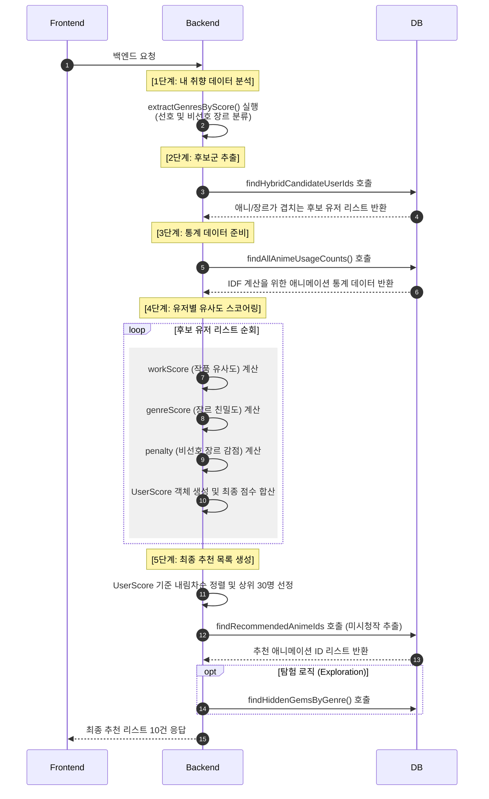

# AniReco

- 목적 : 애니 정보 제공 및 추천 커뮤니티
- 개발기간 : 26.03.12 ~ 26.04.30
- [배포 링크](https://ani-frontend-ek9a.onrender.com/)
- [backend git hub링크](https://github.com/rlarbtns5898-design/ani)

## 목차

- [ 팀 구성원 및 업무 분담](#팀-구성원-및-업무-분담)
- [DB 모델링](#db-모델링)
- [시퀀스 다이어그램](#시퀀스-다이어그램)
- [트러블 슈팅 및 해결](#트러블-슈팅-및-해결)
- [핵심 기능](#핵심-기능)

## 팀구성원 및 업무 분담

#### 김규순

#### 유현호

## DB 모델링

-

## 시퀀스 다이어 그램

-[sequence](./README_img/SEQUENCE.md)

## 트러블 슈팅 및 해결

## 핵심 기능

