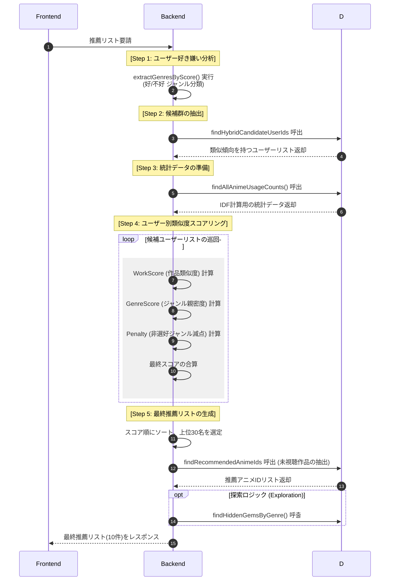

# AniReco

- 目的：アニメ情報の提供および推薦コミュニティ
- 開発期間：2026.03.12 ～ 2026.04.30
- [デプロイリンク](https://ani-frontend-ek9a.onrender.com/)
- [バックエンド GitHub リンク](https://github.com/rlarbtns5898-design/ani)

## 目次

- [チーム構成および担当業務](#チーム構成および担当業務)
- [DBモデリング](#DBモデリング)
- [シーケンスダイアグラム](#シーケンスダイアグラム)
- [トラブルシューティングおよび解決](#トラブルシューティングおよび解決)
- [主要機能](#主要機能)

## チーム構成および担当業務

#### キム・ギュスン

#### ユ・ヒョンホ

## DBモデリング

-

## シーケンスダイアグラム

-[sequence](./README_img/SEQUENCE.md)

## トラブルシューティングおよび解決
### 1. 推薦リストの一般化（人気作への偏り）問題の解決
-【問題点】

初期の推薦ロジックでは、単純な「ジャンル一致」と「共通視聴数」のみを計算していたため、『ONE PIECE』や『進撃の巨人』といった圧倒的多数が視聴しているメジャーな作品ばかりが推薦される現象が発生しました。これにより、ユーザー固有の細かな好みが反映されず、パーソナライズされた結果が出でなく推薦の質が低下する問題がありました。

-【原因分析】

多くのユーザーが視聴している作品は、統計的に「偶然の一致」が発生しやすく、それが計算上のスコアを押し上げてしまうためです。

-【解決策：IDF (逆文書頻度) の導入】

自然言語処理などで用いられるIDF(Inverse Document Frequency)の概念を推薦アルゴリズムに導入しました。

ロジック: 全ユーザーの視聴データに基づき、視聴数が多い作品の重みを下げ、逆に視聴数が少ない希少な作品（ニッチな名作）が一致した場合のスコア(WorkScore)を高く設定しました。

* **数式**:

$$ 
IDF(i) = \log \left( \frac{N + 1}{df(i) + 1} \right) + 1.0 
$$

【結果】メジャー作品に埋もれていた「ユーザーの真の好みに近い作品」が上位に表示されるようになり、推薦の多様性と的中率を大幅に向上させることができました。

### 2. Jikan API フィルター適用エラーの解決

-【問題点】

アニメ検索機能の実装時、ジャンル・テーマ・対象（デモグラフィック）をそれぞれ別々にリクエストしていたが、
フィルターが正しく適用されず、期待した検索結果が取得できなかった。

-【原因分析】

Jikan APIでは、ジャンル・テーマ・対象を個別のパラメータではなく、一つの `genres` パラメータとしてまとめて送る必要があったが、それを誤って理解していた。

-【解決策：パラメータの統一】

公式ドキュメントと実際のレスポンス構造を再確認し、各IDを一つの配列としてまとめ、`genres` パラメータ（例：`genres=1,2,3`）で送信するように修正した。

-【結果】
フィルターが正常に動作するようになり、ユーザーの条件に合った検索結果の精度が向上した。

## 主要機能

### 推薦アルゴリズムの詳細 (Recommendation Logic)

本プロジェクトのコアとなるハイブリッド推薦システムは、以下の3つの主要スコアを合算して算出されます。

1. 作品類似度 (WorkScore) - IDF適用

自分と相手の共通視聴作品における情報の希少性を評価します。

核心: 誰もが見ている作品の一致よりも、少数のファンしか知らない作品の一致を「好みの近さ」として高く評価します。

 
$$
計算: WorkScore = 10 \cdot \sum IDF(i)
$$

2. ジャンル親密度 (GenreScore)

ユーザーが過去に高評価をつけた「選好ジャンル」との一致度を計算します。

extractGenresByScore を通じて動的に抽出された上位3つのジャンルに基づき、比較対象ユーザーの全視聴データと照合し平均化します。

$$
計算: GenreScore = 5 \cdot \text{avg}(\text{matchcount} \cdot 2.0)
$$

3. 非選好ジャンルへのペナルティ (Penalty)

ユーザーが「嫌い」と判断したジャンル（4点以下の評価）が含まれる場合、推薦から排除または順位を下げます。

相手が高評価（7点以上）をつけていても、自分の非選好ジャンルであれば減点処理を行います。

$$
計算: Penalty = \sum (\text{MatchCount} \cdot 1.5)
$$

4. スコア合算と最終選定

$$TotalScore(u) = WorkScore + GenreScore - Penalty
$$

上記の最終スコアに基づき、類似ユーザー上位30名を選定。その30名が視聴済みで、自分が未視聴の作品から最終的な10件を推薦します。

