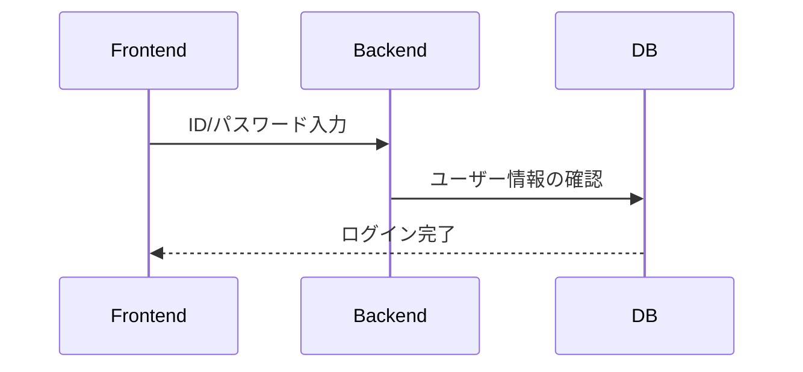
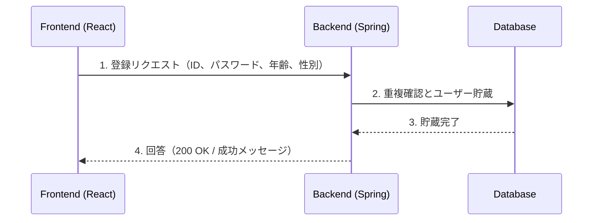
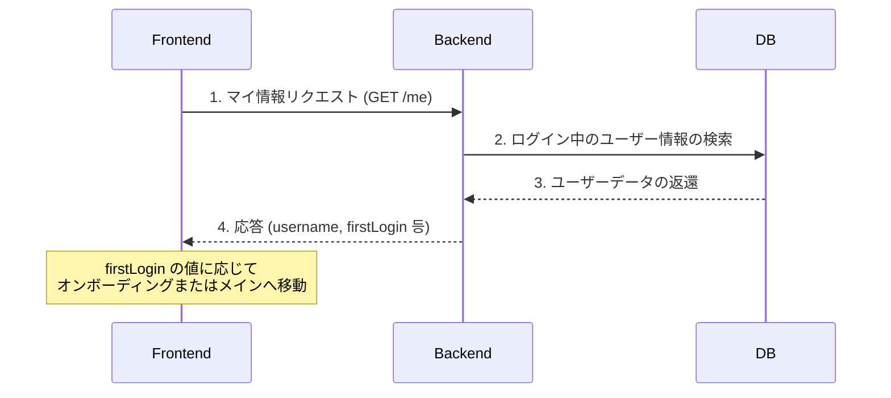
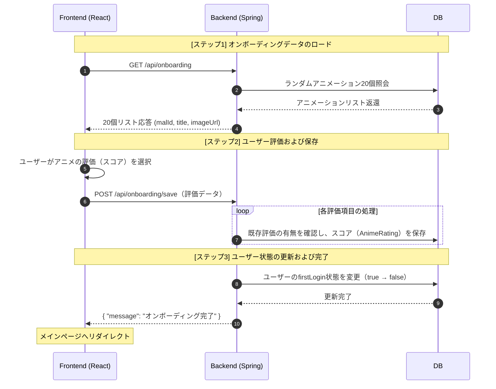
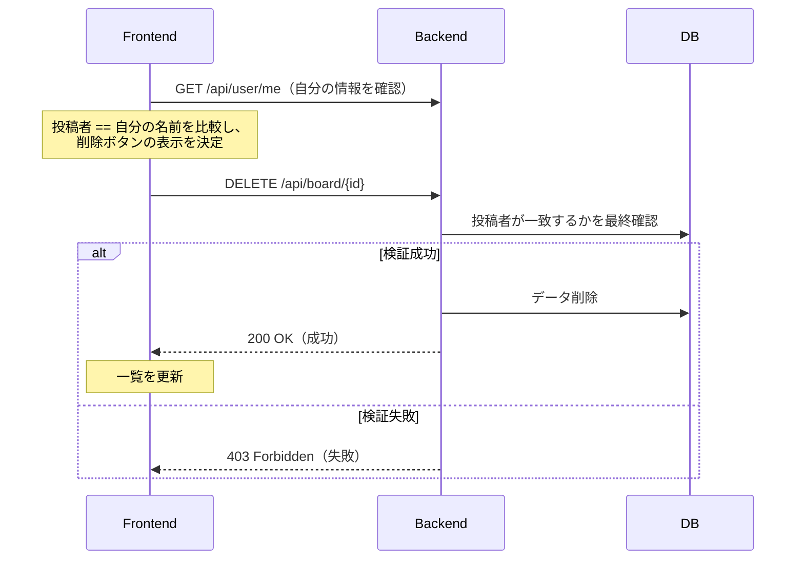
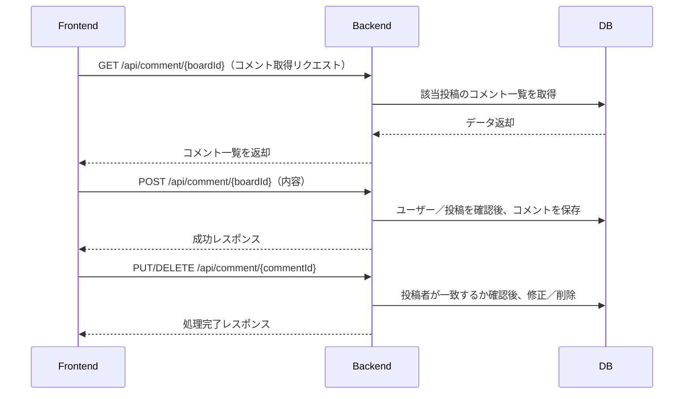
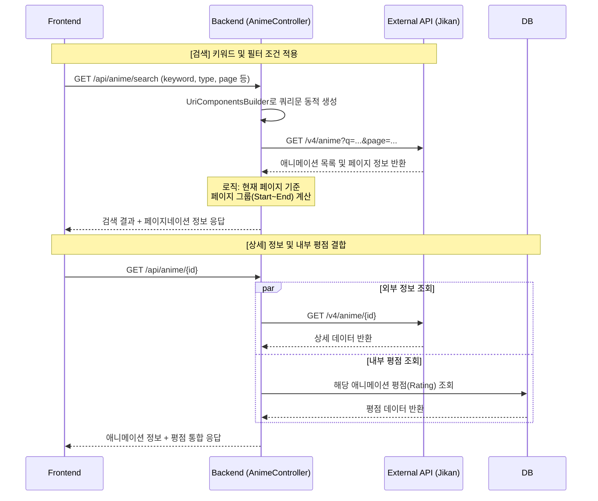
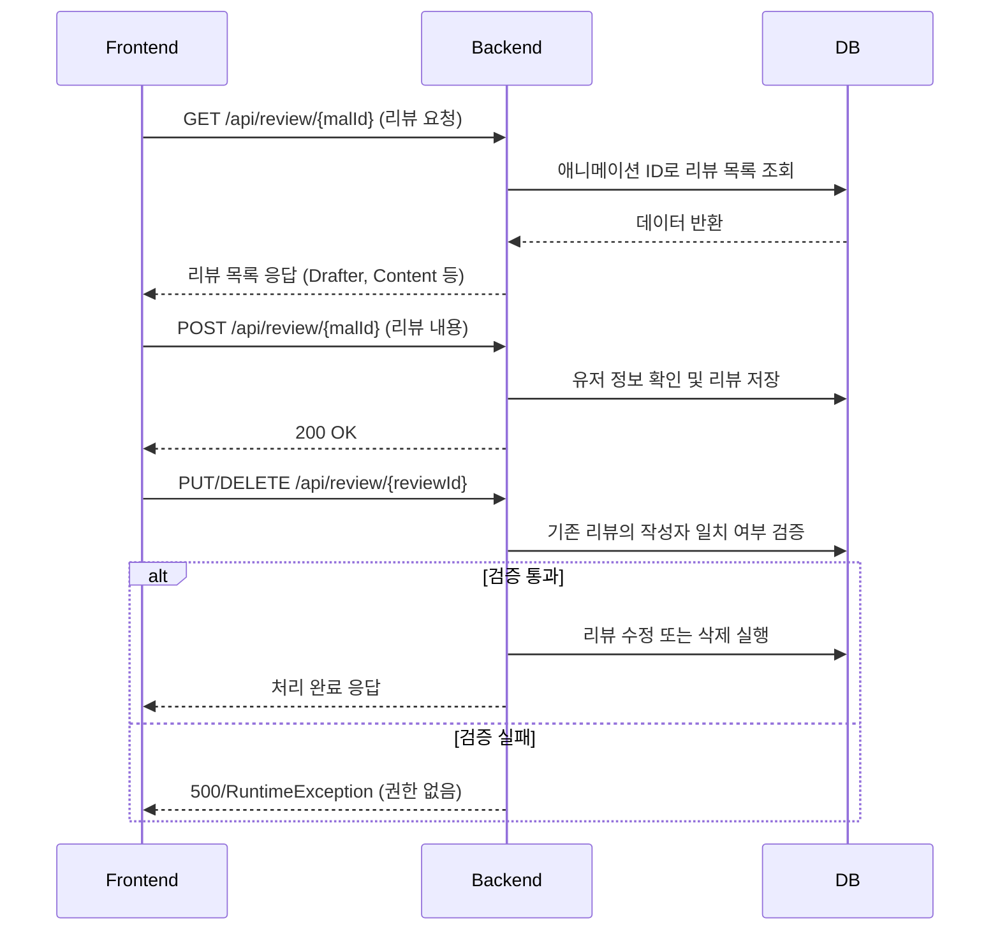
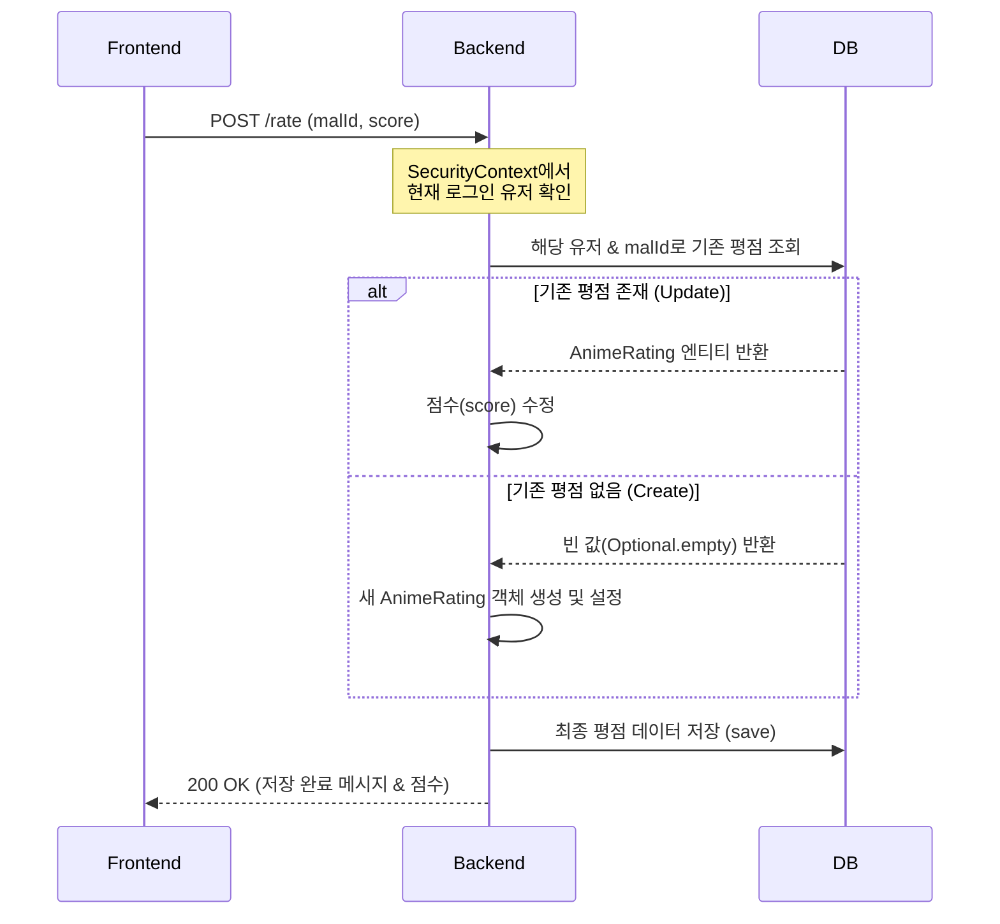
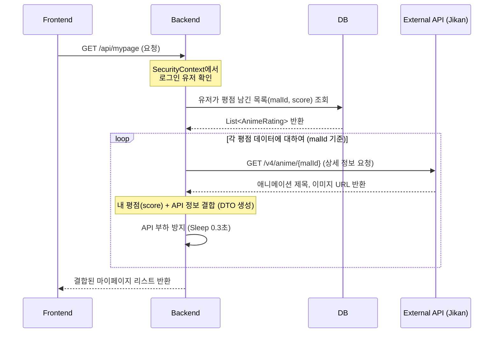

# Sequence Diagrams

## ログイン

```mermaid
sequenceDiagram 
participant Frontend
participant Backend
participant DB

   
    Frontend->>Backend: ID/パスワード入力
    Backend->>DB: ユーザー情報の確認
    DB-->>Frontend: ログイン完了
    
```

## 会員登録

```mermaid
sequenceDiagram
    participant FE as Frontend (React)
    participant BE as Backend (Spring)
    participant DB as Database

    FE->>BE: 1. 登録リクエスト（ID、パスワード、年齢、性別）
    BE->>DB: 2. 重複確認とユーザー貯蔵
    DB-->>BE: 3. 貯蔵完了
    BE-->>FE: 4. 回答（200 OK / 成功メッセージ）
```

## ログイン完了後

```mermaid
sequenceDiagram
    participant FE as Frontend 
    participant BE as Backend 
    participant DB 

    FE->>BE: 1. マイ情報リクエスト (GET /me)
    BE->>DB: 2. ログイン中のユーザー情報の検索
    DB-->>BE: 3. ユーザーデータの返還
    BE-->>FE: 4. 応答 (username, firstLogin 등)
    Note over FE: firstLogin の値に応じて<br/>オンボーディングまたはメインへ移動
```

## 初期ログイン後の評価(onbaording)

```mermaid
sequenceDiagram
    autonumber
    participant FE as Frontend (React)
    participant BE as Backend (Spring)
    participant DB 

    Note over FE, DB: [ステップ1] オンボーディングデータのロード
    FE->>BE: GET /api/onboarding
    BE->>DB: ランダムアニメーション20個照会
    DB-->>BE: アニメーションリスト返還
    BE-->>FE: 20個リスト応答 (malId, title, imageUrl)

    Note over FE, DB: [ステップ2] ユーザー評価および保存
    FE->>FE: ユーザーがアニメの評価（スコア）を選択
    FE->>BE: POST /api/onboarding/save（評価データ）
    
    loop 各評価項目の処理
        BE->>DB: 既存評価の有無を確認し、スコア（AnimeRating）を保存
    end

    Note over FE, DB: [ステップ3] ユーザー状態の更新および完了
    BE->>DB: ユーザーのfirstLogin状態を変更（true → false）
    DB-->>BE: 更新完了
    BE-->>FE: { "message": "オンボーディング完了" }
    
    Note over FE: メインページへリダイレクト
```
## 掲示板

```mermaid
sequenceDiagram
    participant FE as Frontend
    participant BE as Backend
    participant DB 

    %% 1. 権限準備（ボタン表示制御）
    FE->>BE: GET /api/user/me（自分の情報を確認）
    Note over FE: 投稿者 == 自分の名前を比較し、<br/>削除ボタンの表示を決定

    %% 2. 削除実行
    FE->>BE: DELETE /api/board/{id}
    BE->>DB: 投稿者が一致するかを最終確認
    
    alt 検証成功
        BE->>DB: データ削除
        BE-->>FE: 200 OK（成功）
        Note over FE: 一覧を更新
    else 検証失敗
        BE-->>FE: 403 Forbidden（失敗）
    end
```
## コメント

```mermaid
sequenceDiagram
    participant FE as Frontend
    participant BE as Backend
    participant DB 

    %% 1. 取得
    FE->>BE: GET /api/comment/{boardId}（コメント取得リクエスト）
    BE->>DB: 該当投稿のコメント一覧を取得
    DB-->>BE: データ返却
    BE-->>FE: コメント一覧を返却

    %% 2. 作成
    FE->>BE: POST /api/comment/{boardId}（内容）
    BE->>DB: ユーザー／投稿を確認後、コメントを保存
    BE-->>FE: 成功レスポンス

    %% 3. 修正／削除（権限チェック含む）
    FE->>BE: PUT/DELETE /api/comment/{commentId}
    BE->>DB: 投稿者が一致するか確認後、修正／削除
    BE-->>FE: 処理完了レスポンス
```

## 검색

```mermaid
sequenceDiagram
    participant FE as Frontend
    participant BE as Backend (AnimeController)
    participant EXT as External API (Jikan)
    participant DB 

    %% 1. 검색 기능
    Note over FE, EXT: [검색] 키워드 및 필터 조건 적용
    FE->>BE: GET /api/anime/search (keyword, type, page 등)
    BE->>BE: UriComponentsBuilder로 쿼리문 동적 생성
    BE->>EXT: GET /v4/anime?q=...&page=...
    EXT-->>BE: 애니메이션 목록 및 페이지 정보 반환
    
    Note over BE: 로직: 현재 페이지 기준<br/>페이지 그룹(Start~End) 계산
    
    BE-->>FE: 검색 결과 + 페이지네이션 정보 응답

    %% 2. 상세 조회
    Note over FE, DB: [상세] 정보 및 내부 평점 결합
    FE->>BE: GET /api/anime/{id}
    par 외부 정보 조회
        BE->>EXT: GET /v4/anime/{id}
        EXT-->>BE: 상세 데이터 반환
    and 내부 평점 조회
        BE->>DB: 해당 애니메이션 평점(Rating) 조회
        DB-->>BE: 평점 데이터 반환
    end
    
    BE-->>FE: 애니메이션 정보 + 평점 통합 응답
```

## 리뷰

```mermaid
sequenceDiagram
    participant FE as Frontend
    participant BE as Backend
    participant DB 
    %% 1. 조회
    FE->>BE: GET /api/review/{malId} (리뷰 요청)
    BE->>DB: 애니메이션 ID로 리뷰 목록 조회
    DB-->>BE: 데이터 반환
    BE-->>FE: 리뷰 목록 응답 (Drafter, Content 등)

    %% 2. 작성
    FE->>BE: POST /api/review/{malId} (리뷰 내용)
    BE->>DB: 유저 정보 확인 및 리뷰 저장
    BE-->>FE: 200 OK

    %% 3. 수정/삭제
    FE->>BE: PUT/DELETE /api/review/{reviewId}
    BE->>DB: 기존 리뷰의 작성자 일치 여부 검증
    
    alt 검증 통과
        BE->>DB: 리뷰 수정 또는 삭제 실행
        BE-->>FE: 처리 완료 응답
    else 검증 실패
        BE-->>FE: 500/RuntimeException (권한 없음)
    end
```

## 평점

```mermaid
sequenceDiagram
    participant FE as Frontend
    participant BE as Backend
    participant DB 

    FE->>BE: POST /rate (malId, score)
    
    Note over BE: SecurityContext에서<br/>현재 로그인 유저 확인
    
    BE->>DB: 해당 유저 & malId로 기존 평점 조회
    
    alt 기존 평점 존재 (Update)
        DB-->>BE: AnimeRating 엔티티 반환
        BE->>BE: 점수(score) 수정
    else 기존 평점 없음 (Create)
        DB-->>BE: 빈 값(Optional.empty) 반환
        BE->>BE: 새 AnimeRating 객체 생성 및 설정
    end
    
    BE->>DB: 최종 평점 데이터 저장 (save)
    BE-->>FE: 200 OK (저장 완료 메시지 & 점수)
```

## 마이페이지

```mermaid
sequenceDiagram
    participant FE as Frontend
    participant BE as Backend 
    participant DB 
    participant EXT as External API (Jikan)

    FE->>BE: GET /api/mypage (요청)
    
    Note over BE: SecurityContext에서<br/>로그인 유저 확인
    
    BE->>DB: 유저가 평점 남긴 목록(malId, score) 조회
    DB-->>BE: List<AnimeRating> 반환

    loop 각 평점 데이터에 대하여 (malId 기준)
        BE->>EXT: GET /v4/anime/{malId} (상세 정보 요청)
        EXT-->>BE: 애니메이션 제목, 이미지 URL 반환
        Note over BE: 내 평점(score) + API 정보 결합 (DTO 생성)
        BE->>BE: API 부하 방지 (Sleep 0.3초)
    end

    BE-->>FE: 결합된 마이페이지 리스트 반환
```
