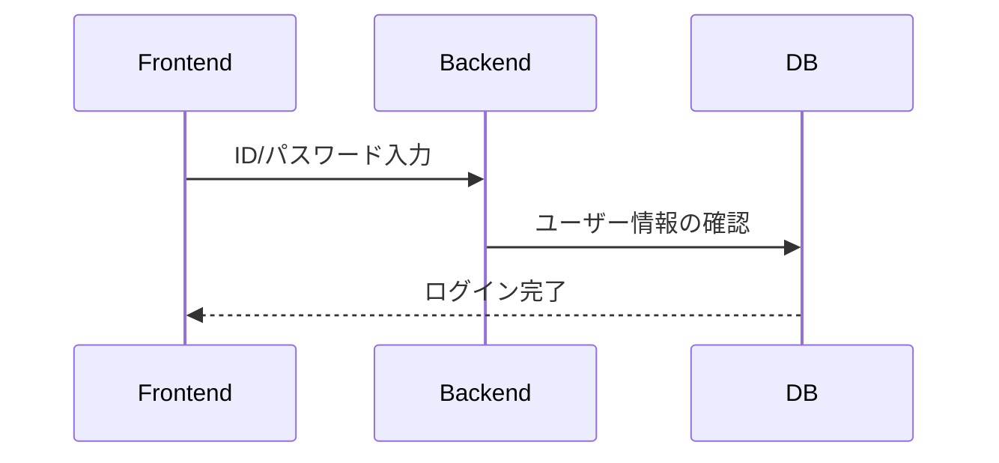
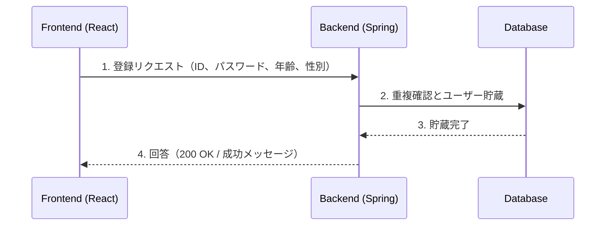
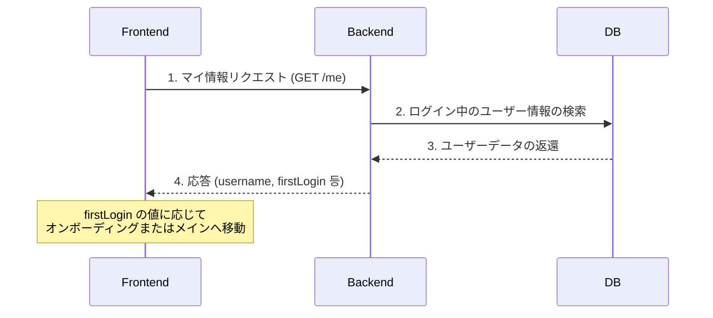
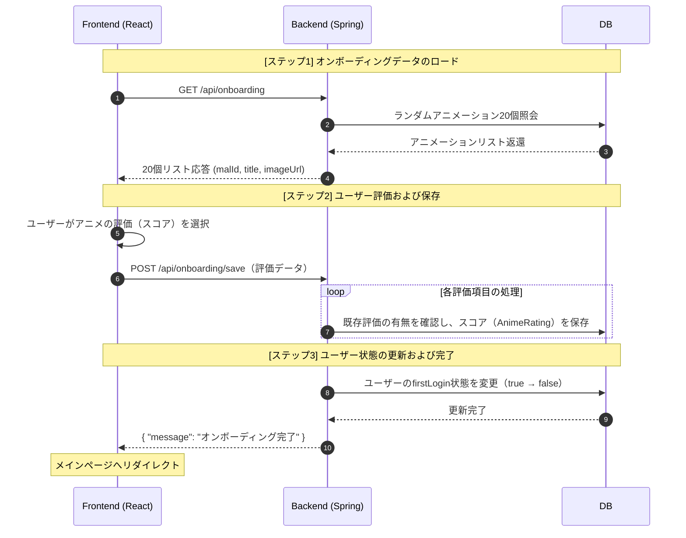
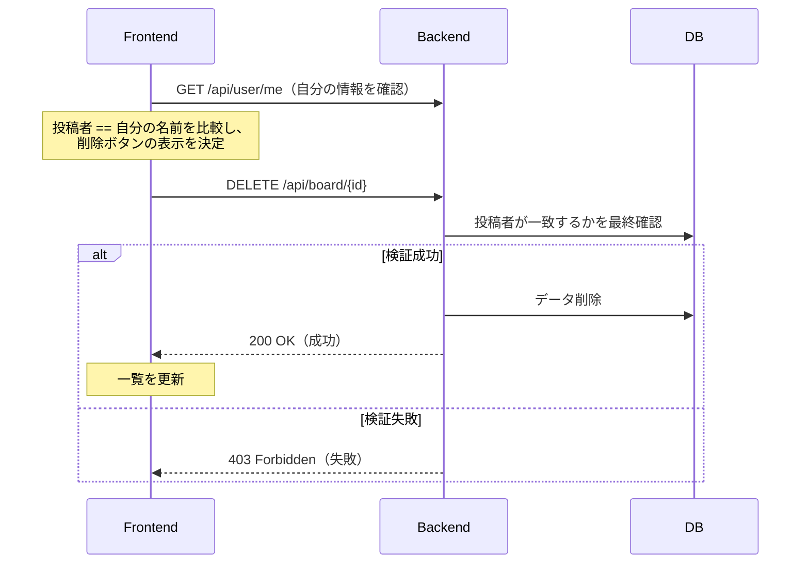
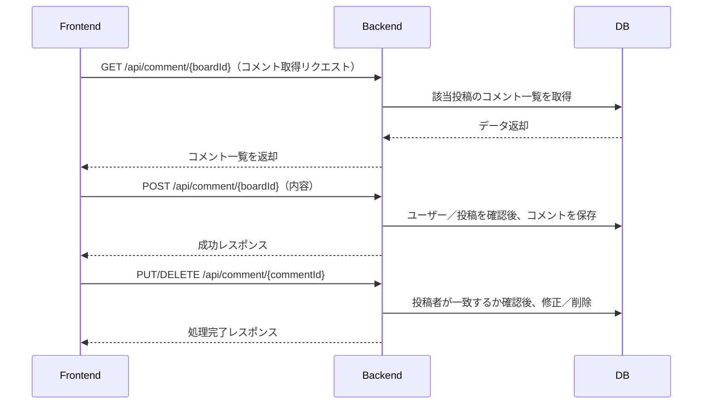
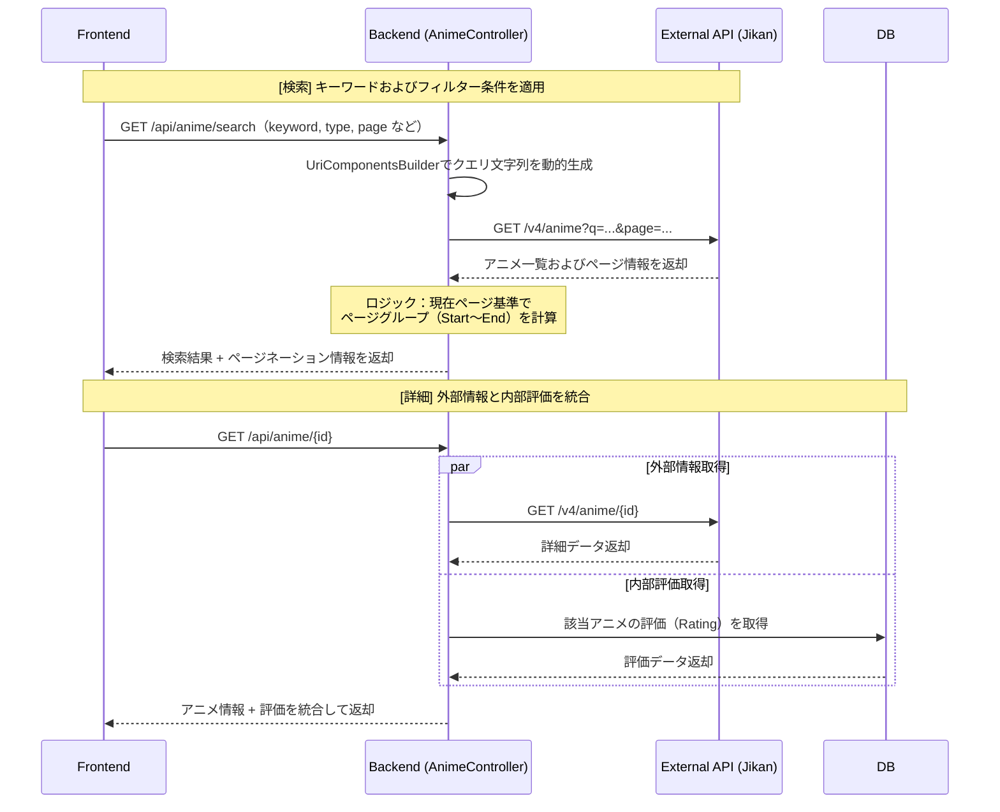
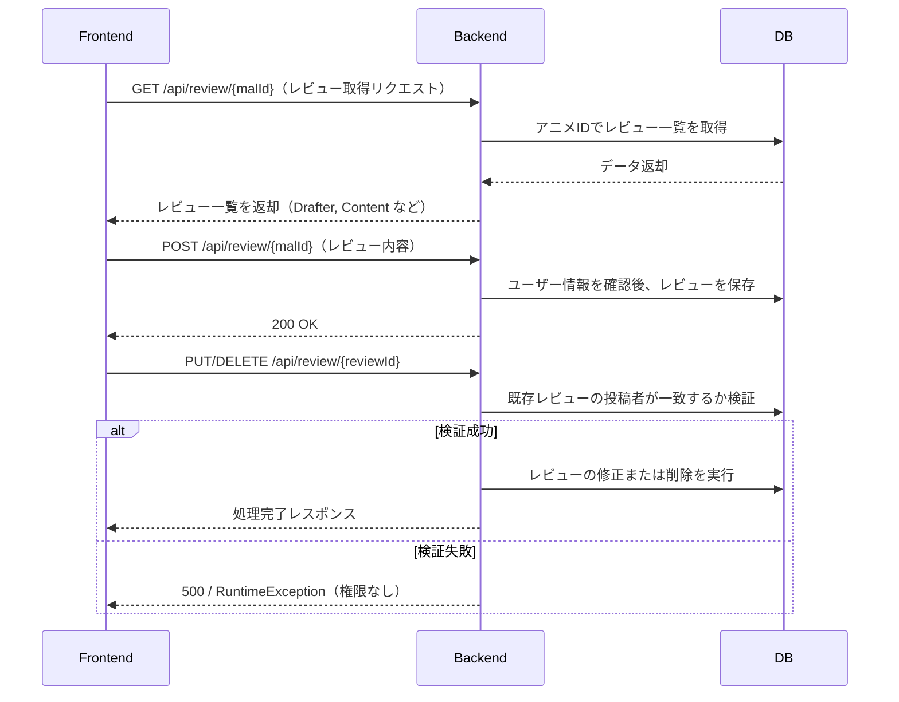
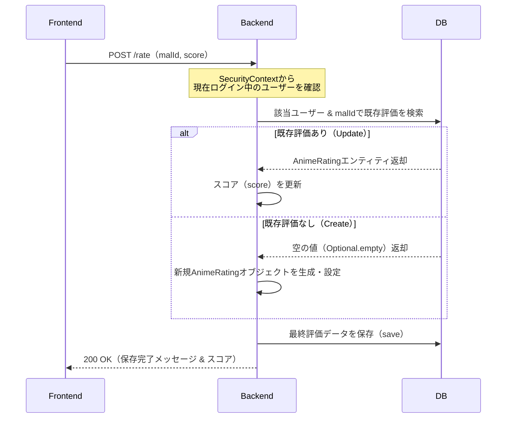
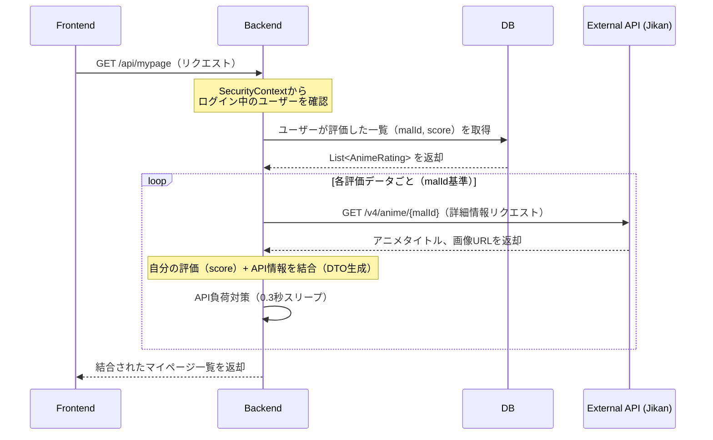

# Sequence Diagrams

## ログイン

```mermaid
sequenceDiagram 
participant Frontend
participant Backend
participant DB

   
    Frontend->>Backend: ID/パスワード入力
    Backend->>DB: ユーザー情報の確認
    DB-->>Frontend: ログイン完了
    
```

## 会員登録

```mermaid
sequenceDiagram
    participant FE as Frontend (React)
    participant BE as Backend (Spring)
    participant DB as Database

    FE->>BE: 1. 登録リクエスト（ID、パスワード、年齢、性別）
    BE->>DB: 2. 重複確認とユーザー貯蔵
    DB-->>BE: 3. 貯蔵完了
    BE-->>FE: 4. 回答（200 OK / 成功メッセージ）
```

## ログイン完了後

```mermaid
sequenceDiagram
    participant FE as Frontend 
    participant BE as Backend 
    participant DB 

    FE->>BE: 1. マイ情報リクエスト (GET /me)
    BE->>DB: 2. ログイン中のユーザー情報の検索
    DB-->>BE: 3. ユーザーデータの返還
    BE-->>FE: 4. 応答 (username, firstLogin 등)
    Note over FE: firstLogin の値に応じて<br/>オンボーディングまたはメインへ移動
```

## 初期ログイン後の評価(onbaording)

```mermaid
sequenceDiagram
    autonumber
    participant FE as Frontend (React)
    participant BE as Backend (Spring)
    participant DB 

    Note over FE, DB: [ステップ1] オンボーディングデータのロード
    FE->>BE: GET /api/onboarding
    BE->>DB: ランダムアニメーション20個照会
    DB-->>BE: アニメーションリスト返還
    BE-->>FE: 20個リスト応答 (malId, title, imageUrl)

    Note over FE, DB: [ステップ2] ユーザー評価および保存
    FE->>FE: ユーザーがアニメの評価（スコア）を選択
    FE->>BE: POST /api/onboarding/save（評価データ）
    
    loop 各評価項目の処理
        BE->>DB: 既存評価の有無を確認し、スコア（AnimeRating）を保存
    end

    Note over FE, DB: [ステップ3] ユーザー状態の更新および完了
    BE->>DB: ユーザーのfirstLogin状態を変更（true → false）
    DB-->>BE: 更新完了
    BE-->>FE: { "message": "オンボーディング完了" }
    
    Note over FE: メインページへリダイレクト
```
## 掲示板

```mermaid
sequenceDiagram
    participant FE as Frontend
    participant BE as Backend
    participant DB 

    %% 1. 権限準備（ボタン表示制御）
    FE->>BE: GET /api/user/me（自分の情報を確認）
    Note over FE: 投稿者 == 自分の名前を比較し、<br/>削除ボタンの表示を決定

    %% 2. 削除実行
    FE->>BE: DELETE /api/board/{id}
    BE->>DB: 投稿者が一致するかを最終確認
    
    alt 検証成功
        BE->>DB: データ削除
        BE-->>FE: 200 OK（成功）
        Note over FE: 一覧を更新
    else 検証失敗
        BE-->>FE: 403 Forbidden（失敗）
    end
```
## コメント

```mermaid
sequenceDiagram
    participant FE as Frontend
    participant BE as Backend
    participant DB 

    %% 1. 取得
    FE->>BE: GET /api/comment/{boardId}（コメント取得リクエスト）
    BE->>DB: 該当投稿のコメント一覧を取得
    DB-->>BE: データ返却
    BE-->>FE: コメント一覧を返却

    %% 2. 作成
    FE->>BE: POST /api/comment/{boardId}（内容）
    BE->>DB: ユーザー／投稿を確認後、コメントを保存
    BE-->>FE: 成功レスポンス

    %% 3. 修正／削除（権限チェック含む）
    FE->>BE: PUT/DELETE /api/comment/{commentId}
    BE->>DB: 投稿者が一致するか確認後、修正／削除
    BE-->>FE: 処理完了レスポンス
```

## 検索

```mermaid
sequenceDiagram
    participant FE as Frontend
    participant BE as Backend (AnimeController)
    participant EXT as External API (Jikan)
    participant DB 

    %% 1. 検索機能
    Note over FE, EXT: [検索] キーワードおよびフィルター条件を適用
    FE->>BE: GET /api/anime/search（keyword, type, page など）
    BE->>BE: UriComponentsBuilderでクエリ文字列を動的生成
    BE->>EXT: GET /v4/anime?q=...&page=...
    EXT-->>BE: アニメ一覧およびページ情報を返却
    
    Note over BE: ロジック：現在ページ基準で<br/>ページグループ（Start〜End）を計算
    
    BE-->>FE: 検索結果 + ページネーション情報を返却

    %% 2. 詳細取得
    Note over FE, DB: [詳細] 外部情報と内部評価を統合
    FE->>BE: GET /api/anime/{id}
    par 外部情報取得
        BE->>EXT: GET /v4/anime/{id}
        EXT-->>BE: 詳細データ返却
    and 内部評価取得
        BE->>DB: 該当アニメの評価（Rating）を取得
        DB-->>BE: 評価データ返却
    end
    
    BE-->>FE: アニメ情報 + 評価を統合して返却
```

## レビュー

```mermaid
sequenceDiagram
    participant FE as Frontend
    participant BE as Backend
    participant DB 

    %% 1. 取得
    FE->>BE: GET /api/review/{malId}（レビュー取得リクエスト）
    BE->>DB: アニメIDでレビュー一覧を取得
    DB-->>BE: データ返却
    BE-->>FE: レビュー一覧を返却（Drafter, Content など）

    %% 2. 作成
    FE->>BE: POST /api/review/{malId}（レビュー内容）
    BE->>DB: ユーザー情報を確認後、レビューを保存
    BE-->>FE: 200 OK

    %% 3. 修正／削除
    FE->>BE: PUT/DELETE /api/review/{reviewId}
    BE->>DB: 既存レビューの投稿者が一致するか検証
    
    alt 検証成功
        BE->>DB: レビューの修正または削除を実行
        BE-->>FE: 処理完了レスポンス
    else 検証失敗
        BE-->>FE: 500 / RuntimeException（権限なし）
    end
```

## 評価

```mermaid
sequenceDiagram
    participant FE as Frontend
    participant BE as Backend
    participant DB 

    FE->>BE: POST /rate（malId, score）
    
    Note over BE: SecurityContextから<br/>現在ログイン中のユーザーを確認
    
    BE->>DB: 該当ユーザー & malIdで既存評価を検索
    
    alt 既存評価あり（Update）
        DB-->>BE: AnimeRatingエンティティ返却
        BE->>BE: スコア（score）を更新
    else 既存評価なし（Create）
        DB-->>BE: 空の値（Optional.empty）返却
        BE->>BE: 新規AnimeRatingオブジェクトを生成・設定
    end
    
    BE->>DB: 最終評価データを保存（save）
    BE-->>FE: 200 OK（保存完了メッセージ & スコア）
```

## マイページ

```mermaid
sequenceDiagram
    participant FE as Frontend
    participant BE as Backend 
    participant DB 
    participant EXT as External API (Jikan)

    FE->>BE: GET /api/mypage（リクエスト）
    
    Note over BE: SecurityContextから<br/>ログイン中のユーザーを確認
    
    BE->>DB: ユーザーが評価した一覧（malId, score）を取得
    DB-->>BE: List<AnimeRating> を返却

    loop 各評価データごと（malId基準）
        BE->>EXT: GET /v4/anime/{malId}（詳細情報リクエスト）
        EXT-->>BE: アニメタイトル、画像URLを返却
        Note over BE: 自分の評価（score）+ API情報を結合（DTO生成）
        BE->>BE: API負荷対策（0.3秒スリープ）
    end

    BE-->>FE: 結合されたマイページ一覧を返却
```
